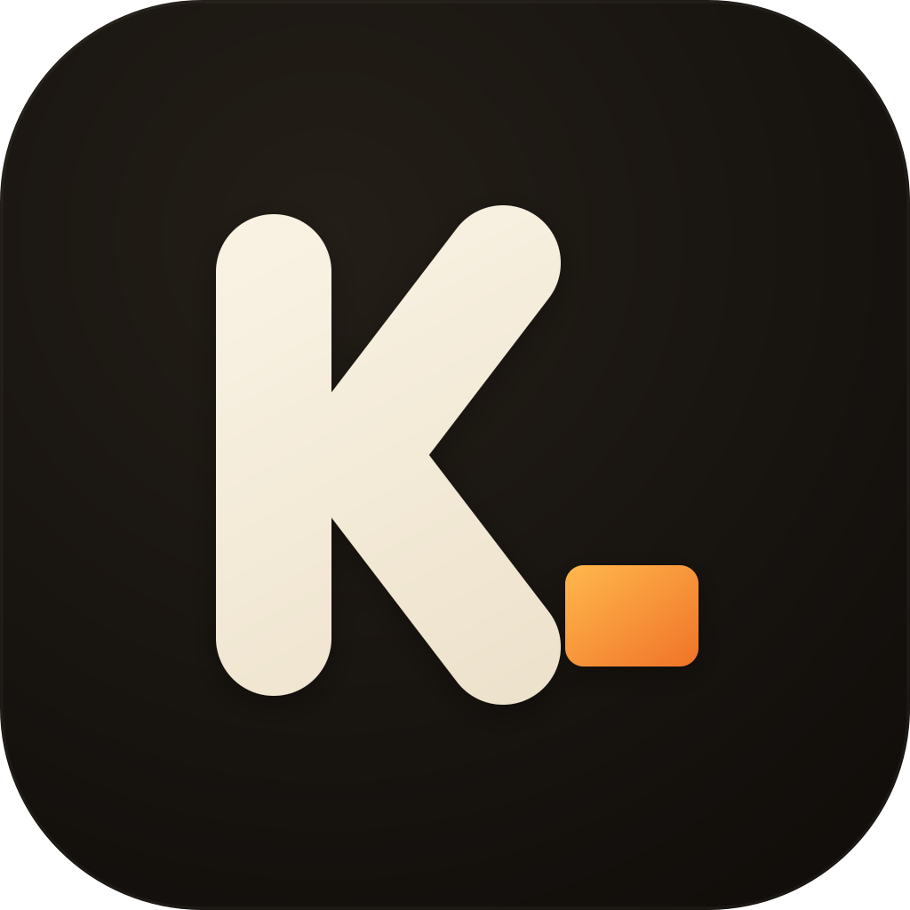
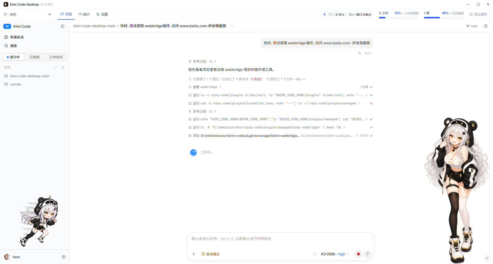
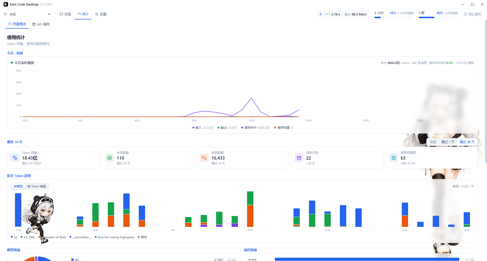
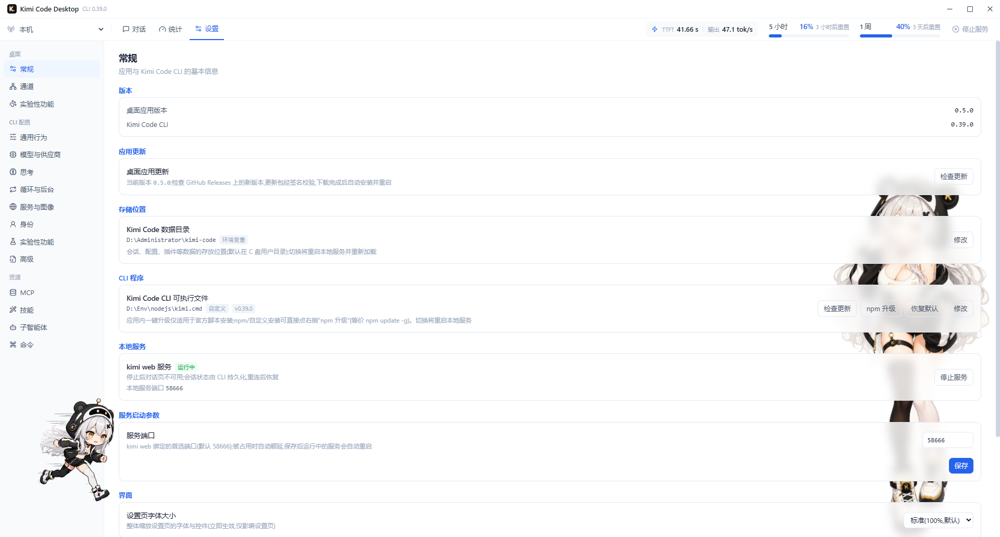
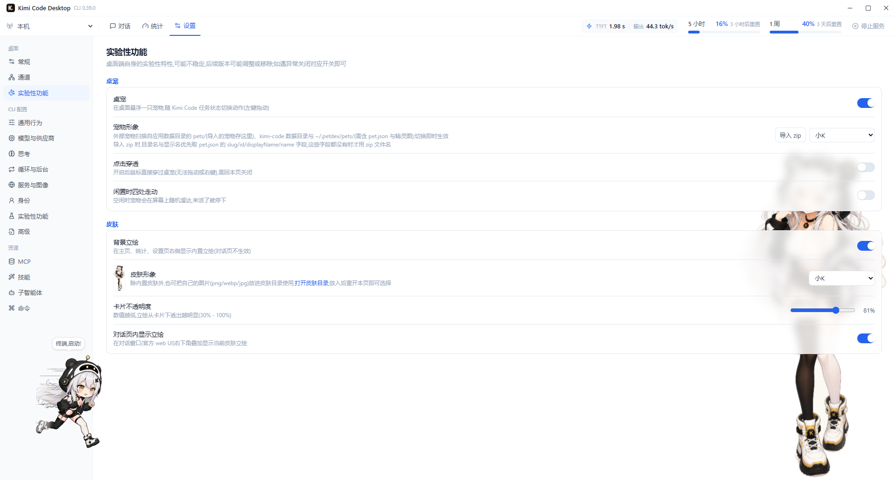

<div align="center">



# Kimi Code Desktop

**[Kimi Code CLI](https://github.com/moonshotai/kimi-code) 的桌面客户端——把官方 Web UI 装进原生窗口,再加用量统计、额度条、桌宠、托盘与自动更新。**

[](https://github.com/Yann-Up/kimi-code-desktop/releases/latest)
[](https://github.com/Yann-Up/kimi-code-desktop/actions/workflows/ci.yml)
[](LICENSE)


中文 · [English](README.md) · [下载 Download](https://github.com/Yann-Up/kimi-code-desktop/releases/latest)

</div>

> **桌面壳,而非 AI 运行时**:对话界面直接内嵌官方 `kimi web` 的 Web UI(iframe),会话、模型、工具、Git 改动面板等能力全部来自官方界面,随 CLI 升级自动同步——**CLI 升级即 UI 升级**。未安装 CLI 时首次启动自动下载安装;已安装则检测更新,询问后一键升级。

## 截图

<table>
  <tr>
    <td></td>
    <td></td>
  </tr>
  <tr>
    <td></td>
    <td></td>
  </tr>
</table>

<div align="center">
  
  <p><sub>桌宠演示:会话进入工作时,宠物从待机切换为奔跑状态</sub></p>
</div>

## 功能

### 对话(官方 Web UI 内嵌)

- iframe 直连本地 `kimi web` 服务(`http://127.0.0.1:<port>/#token=<token>`),token 由壳自动注入,无需登录
- 会话列表、流式回复、工具调用、审批、模型/供应商设置等均由官方 UI 提供
- 聊天中的外链一律转系统浏览器打开,webview 不导航离开应用

### 壳自身提供的能力

- **用量统计**:时间范围、统计卡、GitHub 式活跃热力图、按天模型堆叠趋势、实时曲线
- **标题栏额度条**:各窗口额度(5 小时/1 周/月度)铺平直显 + 实时指标胶囊(TTFT / 输出速度)
- **桌面通知**:窗口失焦时,任务完成 / 待审批 / 待回答发桌面通知
- **桌面宠物**(实验性):透明置顶小窗,状态随会话事件变化,支持气泡提醒与自定义宠物包导入
- **皮肤立绘**(实验性):设置/统计/主页透出立绘,支持自定义皮肤
- **设置**:常规(数据目录、CLI 来源、日志)/ CLI 配置(模型与供应商、权限模式等)/ MCP(可视化 + JSON 编辑,写盘自动备份)/ 技能 / 子智能体 / 命令 / 通道 / 插件
- **桌面集成**:系统托盘、单实例、全平台自绘标题栏(macOS 自绘交通灯)、亮暗双主题

### 远端后端

除本机外,后端 `kimi web` 也可运行在 **WSL** 或 **SSH 主机** 上:内建进程内 SSH 客户端与端口转发,host key 采用 TOFU 校验,密码只存系统凭据管理器,不落明文。

### 自动更新

内置自动更新(tauri-plugin-updater):启动静默检查,发现新版在标题栏出红点,确认后自动下载、安装并重启;更新包经 minisign 签名校验。国内用户走 CNB 镜像加速,GitHub Releases 兜底。

## 下载

从 [Releases](https://github.com/Yann-Up/kimi-code-desktop/releases/latest) 获取最新版:

| 平台 | 文件 | 说明 |
| --- | --- | --- |
| Windows x64 | `*_x64-setup.exe` | NSIS 安装版(推荐) |
| Windows x64 | `*_x64-portable.zip` | 免安装便携版 |
| Windows x64 | `*_x64_en-US.msi` | MSI 安装包 |
| macOS(Apple Silicon) | `*_aarch64.dmg` | 仅 M 系列芯片;**未签名未公证**,见下方说明 |

> ⚠️ **macOS 首次打开会被 Gatekeeper 拦截**(未付费签名/公证),二选一:
> 1. 系统设置 → 隐私与安全性 → 找到 "Kimi Code Desktop" → **仍要打开**
> 2. 终端执行:`xattr -d com.apple.quarantine /Applications/Kimi\ Code\ Desktop.app`

## 架构

```
Tauri Rust 后端(src-tauri/)
  ├── CLI 自检测:未安装→官方脚本自动安装;有更新→询问后升级
  ├── spawn `kimi web --no-open --port <空闲端口>`   # 后端服务(本机/WSL/SSH)
  │     从 stdout banner / PTY 输出解析地址与 token
  ├── web_ui_url 命令 → http://127.0.0.1:<port>/#token=<token>(供 iframe 加载)
  ├── WS 通知订阅器 → /api/v1/ws(壳内部订阅,不转发给渲染层)
  │     枚举会话订阅 turn.ended / work_changed → 失焦时发桌面通知
  ├── REST 客户端 → /api/v1/*(Bearer 认证,额度/统计等壳自身功能使用)
  └── 本地数据   → kimi_home 直读(技能/子代理/mcp.json/usage 聚合/盘符)
渲染进程(React + zustand,src/)
  ├── components/ShellHome.tsx  视图容器:对话(iframe)/ 统计 / 设置
  ├── components/TitleBar.tsx   标题栏:额度条 + 导航 + 窗口控制
  ├── platform/kimi-api.ts      壳与渲染层之间的 API 契约(window.kimiApi)
  ├── platform/tauri.ts         契约的 Tauri 实现(invoke/事件监听)
  └── stores/ui.ts              界面状态
```

## 安全说明

- **Bearer token 不出本机**:REST/WS/iframe 只连 `127.0.0.1`,token 由壳持有,日志按 "token" 关键字过滤
- **SSH host key 采用 TOFU**:首次连接记录指纹到配置目录 `known_hosts`,指纹变更即拒绝连接;SSH 密码只存系统凭据管理器
- **外链隔离**:聊天内容中的链接一律由系统浏览器打开(仅放行 http/https)
- **配置原子写**:`desktop-config.json` / `mcp.json` 先写临时文件再替换;mcp.json 另有 `.kimi-desktop-bak` 备份
- CLI 自动安装使用官方安装脚本(`irm | iex` / `curl | sh`),与官方文档推荐方式一致

## 开发

```bash
npm install
npm run tauri:dev      # 开发(vite dev 5188 端口 + cargo 增量编译,首次较慢)
npm run typecheck      # 渲染层与 vite 配置的 TS 检查
```

需要 Rust 工具链(cargo)。Windows 下使用系统 WebView2,安装包体积显著小于 Electron 方案。

```bash
# 打包(已开启 updater 产物,本地打包需指向签名私钥):
export TAURI_SIGNING_PRIVATE_KEY_PATH=~/.tauri/kimi-desktop.key   # Windows: set 或 $env:
npm run tauri:build    # 产出当前平台的安装包(src-tauri/target/release/bundle/)
```

### 发版(维护者)

tag 触发 `.github/workflows/release.yml`(Windows → macOS 串行构建 + 签名 + latest.json,产出草稿 Release),正式发布后 `sync-cnb.yml` 同步到 CNB 镜像:

```bash
# 1. 三处版本号保持一致:src-tauri/tauri.conf.json、src-tauri/Cargo.toml、package.json
# 2. 提交后打 tag 并推送
git tag v0.5.6 && git push --tags
# 3. workflow 产出草稿 Release;确认后在 Releases 页发布为正式版
```

需要一次性配置仓库 Secrets:`TAURI_SIGNING_PRIVATE_KEY`(开发机 `~/.tauri/kimi-desktop.key` 的文件内容;该私钥无密码、不入库,丢失则无法继续签发更新)与 `CNB_TOKEN`(镜像同步)。签名公钥内嵌于 `src-tauri/tauri.conf.json` 的 `plugins.updater.pubkey`。

## 行为说明

- **启动自动拉起服务**:打开应用即自动启动激活通道(本机/WSL/SSH)的 Kimi Code 服务并加载官方 Web UI;本机未安装 CLI 时先弹安装确认,不静默下载,已自行安装(npm/brew)可点「重新检测」。可在 设置 → 常规 → 本地服务 关闭自动拉起;服务启停入口:对话页占位图(启动)与 设置 → 常规(启停),停止仅当次会话有效,统计/设置等本地页面不受影响
- 已知限制:通知点击不聚焦主窗口(插件限制)、通知不带图标

## 贡献

欢迎 Issue 与 Pull Request。提交前请确保:

- `npm run typecheck` 通过
- `cd src-tauri && cargo check` 通过

提交 PR 即表示你同意以本项目的 MIT 许可证授权你的贡献。觉得好用的话,欢迎点个 ⭐

## 商标声明

"Kimi"、"Kimi Code" 及相关名称与标识的权利归 Moonshot AI(月之暗面)所有。本项目是基于 Kimi Code CLI 的桌面客户端壳,使用这些名称仅为描述兼容性目的。

## License

Copyright (C) 2025 Kimi Code Desktop contributors

本项目以 [MIT License](LICENSE) 开源。要点(以许可证原文为准):

- **可以自由使用、复制、修改、分发**,包括商业用途和闭源分发——MIT 不附加开源义务
- **唯一要求**:保留版权声明与许可证文本
- 本软件按"原样"提供,不附带任何担保

第三方运行时/构建依赖均为宽松许可证(MIT / Apache-2.0 / BSD / ISC),与 MIT 兼容。Kimi Code CLI 本身由 Moonshot AI 按其自身条款分发,不属于本仓库的授权范围。

